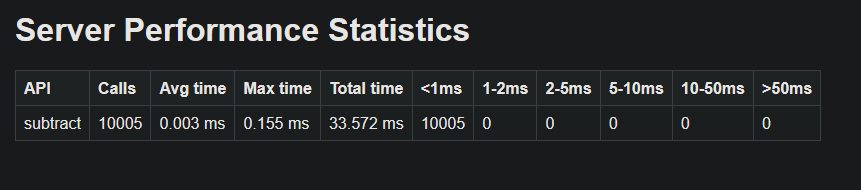
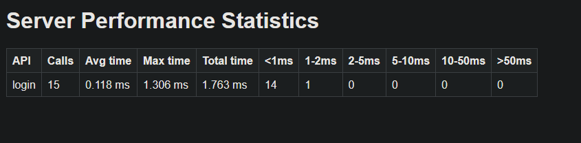

<em>sample_http /subtract api</em>

<em>auth_server /login api, with coroutines running, database checks & updates, 550 login requests/s</em>

# About

Common code libraries and setups for distributed system server nodes put behind reverse proxies.

Ideally the reverse proxies will do the security and rate limitations for you, saving you dev time to focus on other things.

Dependency on libuv for timers, sockets/udp/tcp, event loops and threading.

# Modules

- sample_server: Sample TCP server with multiple examples, a single tcp server example, another multithreaded example, and an incomplete forked child process version.

- alt_program: TCP Client

- sample_http_server: Sample http server supporting only [JSONRPC](https://www.jsonrpc.org/) capability

- auth_server: Sample authentication server with login endpoint and restricted endpoint, using JWT for authentication, libpq connection to database, coroutines

- prometheous_test: sample server endpoint for prometheus monitoring tools

# Building

### Prerequisites

Development with WSL

- WSL, VSCode (preferred). Follow the following linux instructions

Linux

- `apt-get` packages: g++, make, build-essentials, libuv1-dev

- for `auth_server`: libpq and [libjwt-dev](https://github.com/benmcollins/libjwt), `apt-get postgresql` for database, Then run db script in `auth_server/db_scripts` like so: `psql -U postgres -h localhost -d postgres -f db_scripts/reset_and_seed.sql`

- `apt-get install libuv1-dbgsym` for debugging libuv

### Dev with Vscode

- Make sure you have vscode installed, open a cmd prompt at the base path, type `bash` to log into wsl, then `code .`

- Make sure you can see a `WSL:Ubuntu` at the bottom left

- you can modify what to build in `.vscode/tasks.json` under the `"command"` keyword

- you can modify which executable to run in `.vscode/launch.json` under the `"program"` keyword

### Building

- Open a linux terminal in whatever ide you have, run `make`

- to clean `make clean`

### Outputs

- Built outputs should be located in the subfolder. You can place your config files there.

# Modifying

- You can add new services at the base `Makefile` by adding a subdir and source files. Polyglot languages are allowed as long as they have a makefile and the appropriate packages installed

# Features

- Server Logging with automated rotations

- Http parser [picohttpparser](https://github.com/h2o/picohttpparser)

- Json Parser/Serializer (yyjson)

- Performance statistics html page generation and performance measuring/tracking

- tcp/http server setups, with asynchronous jobs

- Authentication using JWT, check `auth_server`

# Good overheads to know before optimizing

Good prompts for AI: 

- "how fast is forwarding a request from nginx to a localhost server" Answer: 0.2ms to (under) 1ms

- "how fast is a mutex lock" Answer: if uncontested, 10–40 nanoseconds, If another thread is using the lock, the operating system must step in to park the waiting thread. This context switch requires a trip into kernel space, costing 1,000 to over 10,000 clock cycles (frequently 500+ nanoseconds

- "what are nginx's size limits for http?" - controls size input

- "tuning a libuv tcp server"

- "how fast can database queries and updates range from"

# Good debugging/testing tips

- `apt install inetutils-telnet` and then ` telnet 127.0.0.1 <port>` for sending tcp messages

- use your browser, navigate to `http://127.0.0.1:<port>` to send http messsages

-  `apt install apache2-utils` abd then `ab -n 10000 -c 100 http://localhost:3000/` to blast messages/loadtest

# More references

- https://stackoverflow.com/questions/45001349/should-we-use-multiple-acceptor-sockets-to-accept-a-large-number-of-connections

- Prompt "libuv event loop", ask what function calls map to what parts of the loop. Notably, the Poll I/O dynamically calculates a timeout

- [Why no stack allocation for receiving buffer](https://groups.google.com/g/libuv/c/fRNQV_QGgaA)
