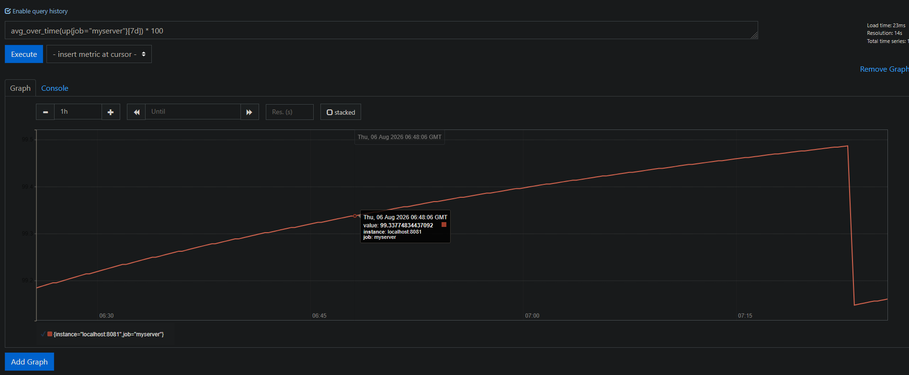

# About

Prometheous is a server metrics gathering tool. It pings your server for data on a fixed timer.

## Installing prometheous

- `sudo apt-get install prometheus`

## Integrating

1) Configure Prometheous's yml file at `/etc/prometheus/prometheus.yml` accordingly

```
scrape_configs:
  - job_name: 'myserver'
    metrics_path: '/metrics'
	scrape_interval: 15s
    static_configs:
      - targets: ['localhost:8081']
```

1a) Reload `systemctl reload prometheus`

2) Make sure you have a http endpoint that spits out http responses with the body in the logging format stated after this section

3) webbrowser http://localhost:9090 click `Status->Targets` on the topbar. Can also query `avg_over_time(up{job="myserver"}[7d]) * 100`


## Logging format

[Prometheous text-based exposition format](https://github.com/prometheus/docs/blob/main/docs/instrumenting/exposition_formats.md)

## Other

- Grafana for monitoring dashboards: https://grafana.com/docs/grafana/latest/setup-grafana/installation/

